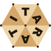
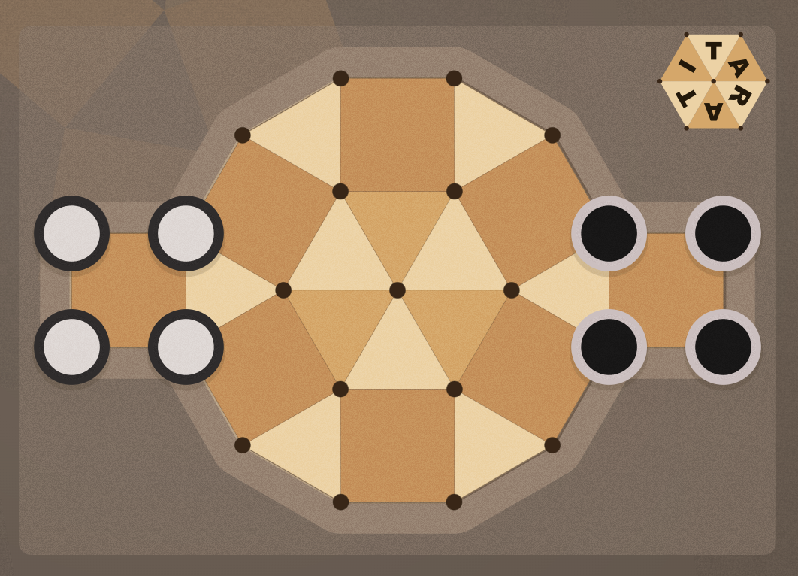
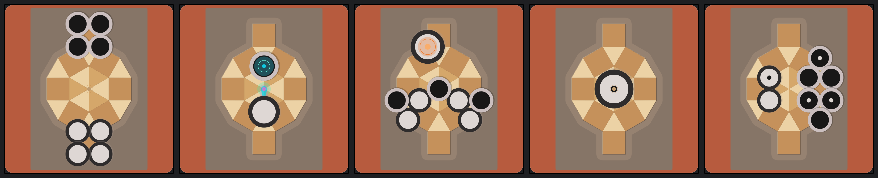
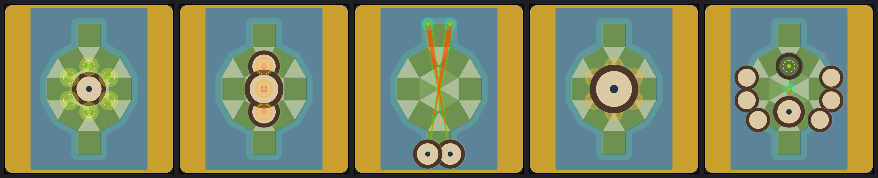

# Tarati — Un Juego de Tablero por George Spencer-Brown

<div align="center">



[](https://kotlinlang.org)
[](https://www.jetbrains.com/lp/compose-multiplatform/)
[](https://developer.android.com/jetpack/androidx/releases/room)
[](https://www.android.com)
[](https://www.jetbrains.com/lp/compose-multiplatform/)
[](https://tarati.tech)
[](https://6e61646965.itch.io/tarati)
[](README.md)

**Implementación multiplataforma (Android · Desktop · Web) del juego de estrategia Tarati**

[Jugar Online](https://tarati.tech) · [Google Play](#descargar) · [Reglas](#reglas) · [Tecnologías](#tecnologías) · [Descargar Desktop](#desktop)

</div>

---

## Plataformas Disponibles

### Web

Jugá directamente en **[tarati.tech](https://tarati.tech)** — sin instalación. Matchmaking online, partidas
clasificatorias y funciones sociales.

### Android

**Versión 1.0.0** — Disponible en Google Play  
Requisitos: Android 8.0+ (API 26)

### Desktop

**Versión 1.0.0** — Windows · macOS · Linux  
Requisitos: Windows 10+ · macOS 11+ · Linux (Ubuntu 20.04+)

### iOS

En desarrollo

---

## El Juego

**Tarati** es un juego de mesa estratégico creado por George Spencer-Brown, autor de *Laws of Form*, que aplica su
cálculo de distinciones al juego. La estructura es minimalista pero las consecuencias son profundas: los jugadores
mueven piezas, voltean piezas enemigas y promueven las propias a través de un tablero de 23 vértices organizados en
zonas concéntricas.



### Origen

Diseñado como aplicación práctica del cálculo de distinciones de Brown, Tarati encarna los principios matemáticos y
filosóficos de *Laws of Form* — obra fundamental que explora la lógica a través del concepto de distinción.

---

## Reglas

### Objetivo

Capturar la última pieza enemiga en un solo movimiento (Mit) o dejar al oponente sin movimientos legales (Stalemit).

### Estructura del Tablero

El tablero tiene 23 vértices distribuidos en cuatro zonas (no completamente disjuntas):

- **Centro absoluto**: 1 vértice (A1)
- **Puente**: 6 vértices que conectan el centro con la circunferencia
- **Circunferencia**: 12 vértices que forman el anillo exterior
- **Bases domésticas**: 4 vértices por jugador (8 en total); 2 son vértices D exclusivos y 2 son vértices C compartidos
  con la circunferencia

Cada jugador comienza con 4 Cobs colocados en su base doméstica.

### Piezas

**Cob** — la pieza básica. Se mueve solo hacia adelante, por aristas en dirección a la base enemiga. No puede retroceder
salvo que sea promovida.

**Rok** — un Cob promovido. Se mueve libremente en cualquier dirección a lo largo de cualquier arista. Un Cob se
convierte en Rok al entrar en cualquier vértice de la base doméstica del oponente. Un Rok capturado conserva su estado
de Rok: cambia de color, pero sigue siendo Rok.

### Movimiento

Una pieza se mueve a un vértice adyacente libre. Al llegar, voltea todas las piezas enemigas elegibles conectadas
directamente a ese vértice, convirtiéndolas al color del jugador activo.

Excepción: un Cob en su propia base doméstica puede moverse en cualquier dirección, pero solo si ese movimiento produce
al menos una captura.

### Regla de Pre-adyacencia

Solo se puede capturar una pieza enemiga si la pieza que se mueve **no era adyacente a ella antes del movimiento**. Es
decir, únicamente las piezas enemigas que son nuevas vecinas del destino — y no lo eran del origen — quedan volteadas.
Las piezas que ya eran adyacentes al origen quedan protegidas.

Esta es la regla táctica más importante del juego: hay que aproximarse desde afuera.

### Piezas Muertas y Promoción Forzada

Un Cob puede quedar **muerto** — atrapado sin posibilidad de avanzar. La patente define dos situaciones en las que esto
ocurre:

**Muerte primaria.** Un Cob que es capturado y volteado sobre uno de los dos vértices más exteriores de la base enemiga
queda muerto de inmediato. Desde esos vértices no existe ningún camino hacia adelante: la pieza no puede moverse por sus
propios medios.

**Muerte por cadena.** Un Cob también queda muerto si todos sus vértices adyacentes hacia adelante están ocupados por
Cobs muertos del mismo color. Esta condición se propaga: una pieza puede morir porque la bloquea otra que murió por la
misma razón, y así sucesivamente. La cadena siempre termina en un vértice de muerte primaria.

**Qué no produce muerte.** Una pieza no queda muerta por estar bloqueada por una pieza enemiga, por un Cob vivo del
mismo color, ni por un Rok de cualquier color — porque cualquiera de esos bloqueadores puede moverse y liberar el
camino. Solo los Cobs muertos del mismo color bloquean de forma permanente. Los Roks nunca están muertos.

**Cuándo se puede promover una pieza muerta.** La promoción de un Cob muerto a Rok no es automática. Solo ocurre cuando
el jugador no puede realizar ningún movimiento normal. En ese caso, puede promover uno de sus Cobs muertos — pero
únicamente si el Rok resultante tendría al menos un movimiento disponible. Si la promoción no resuelve la inmovilidad,
esa pieza no puede promoverse.

**Caso especial — última pieza.** Si un Cob es la única pieza del jugador que queda en el tablero, debe promoverse a Rok
de forma obligatoria, sin importar en qué vértice se encuentre y aunque el jugador todavía pueda mover otras piezas.

### Condiciones de Fin de Partida

La partida termina cuando:

- **Mit**: un jugador captura todas las piezas enemigas en un solo movimiento.
- **Stalemit**: el jugador activo no tiene movimientos normales ni promociones forzadas disponibles. Gana el oponente.
- **Triple repetición**: la misma posición de tablero aparece tres veces con el mismo jugador a mover. Pierde el jugador
  que provocó la tercera repetición.
- **Regla de 50 movimientos**: si transcurren 100 semimovimientos consecutivos sin un movimiento de Cob ni ninguna
  promoción, el jugador activo puede reclamar tablas. Un jugador con un movimiento ganador disponible no puede reclamar.
- **Tiempo agotado**: en partidas con control de tiempo, el jugador que supera su límite pierde.

---

## Logros

¡Tarati tiene logros! (Android)

**Empezando**



- Bienvenido a Tarati — Termina el tutorial
- Primera captura — Voltea tu primera pieza
- Primera promoción — Sube un Cob a Rok
- Primera victoria — Gana a la IA

**El farmeo**



- 10 partidas jugadas — Lo que dice
- El volteador — 50 capturas total
- Maestro Rok — 25 promociones en todas las partidas
- Imparable — 10 victorias vs IA
- Campeón — Gana en dificultad máxima

Y hay **logros secretos** escondidos. Descúbrelos tú mismo.

---

## Capturas de Pantalla

### Android

|  |  |  |
|-------------------------------------------------------|--------------------------------------------------------|-------------------------------------------------------|
|  |   |  |

### Desktop (Windows)

|  |  |
|--------------------------------------------------------|--------------------------------------------------------|
|  |  |

Interfaz intuitiva construida con Jetpack Compose / Compose Multiplatform.

---

## Descargar

### Android

[](https://play.google.com/store/apps/details?id=com.agustin.tarati)

[](https://github.com/AgustinGomila/tarati-kmp/releases)

**Requisitos:**

- Android 8.0 (API 26) o superior
- 5–10 MB de espacio libre
- Pantalla táctil

### Desktop

[](https://github.com/AgustinGomila/tarati-kmp/releases)
[](https://github.com/AgustinGomila/tarati-kmp/releases)
[](https://github.com/AgustinGomila/tarati-kmp/releases)

**Requisitos:**

- Windows 10+, macOS 11+, o Linux (Ubuntu 20.04+)
- Autocontenido — no requiere runtime de Java
- 50–100 MB de espacio libre

### itch.io

Todos los instaladores de escritorio y el APK de Android también están publicados en itch.io:

[](https://6e61646965.itch.io/tarati)

---

## Características

- **Motor IA con cuatro niveles de dificultad** — Minimax con poda Alpha-Beta, profundización iterativa y tabla de
  transposición
- **Control de tiempo** — Unlimited, Sudden Death, Fischer, Bronstein y Byoyomi con formatos adaptativos
- **Pre-movimientos** — selección anticipada durante el turno de la IA
- **Paletas de colores intercambiables** — incluyendo paletas de temporada y temas especiales
- **Tipos de pieza personalizables** — selector visual con animación
- **Biblioteca de partidas** — historial completo con navegación por movimientos
- **Tutorial interactivo** — burbujas de guía superpuestas al tablero
- **Logros** — cross-platform, sincronizados al servidor; integración Google Play Games en Android
- **Soporte bilingüe** — español e inglés con selector in-app
- **Multijugador online** — matchmaking, rating Glicko-2, clasificación, perfiles públicos, seguidos, desafíos,
  modo espectador, revanchas, reconexión y torneos (Round Robin, Swiss, Arena y eliminación directa)
  en [tarati.tech](https://tarati.tech)
- **Acceso como invitado** — jugá online sin registrarte
- **Panel lateral adaptativo** — en pantallas anchas, lobby, configuración y biblioteca coexisten junto al tablero
- **Multiplataforma** — mismo código compartido entre Android, Desktop y Web

---

## Tecnologías

| Componente                | Librería / Versión                                                            |
|---------------------------|-------------------------------------------------------------------------------|
| Lenguaje                  | Kotlin 2.4.0                                                                  |
| Arquitectura              | Kotlin Multiplatform (KMP)                                                    |
| UI                        | Compose Multiplatform 1.10.3, Material Design 3                               |
| Inyección de dependencias | Koin 4.2.2                                                                    |
| Almacenamiento local      | Room 2.8.4 (Android/Desktop), DataStore 1.2.1 (Android)                       |
| Tests                     | JUnit 4.13.2, MockK 1.14.11, Coroutines Test 1.11.0                           |
| Concurrencia              | Kotlin Coroutines 1.11.0                                                      |
| Networking                | Ktor 3.5.0 (cliente + servidor, online en tarati.tech)                        |
| Cliente Redis             | Kreds 0.9.1 (Kotlin-nativo, coroutines-first)                                 |
| Base de datos (servidor)  | PostgreSQL 16, Exposed ORM 1.3.0                                              |
| Auth (servidor)           | Auth0 java-jwt 4.5.2, jBCrypt 0.4                                             |
| Serialización             | kotlinx-serialization 1.11.0                                                  |
| Tiempo                    | kotlinx-datetime 0.8.0                                                        |
| IA                        | Minimax con poda Alpha-Beta, profundización iterativa, tabla de transposición |

### Arquitectura Multiplatforma

```
Tarati/
├── shared/              # Kotlin Multiplatform (~90% código compartido)
│   ├── commonMain/     # Código común (UI, lógica, IA, ViewModels)
│   ├── androidMain/    # Android-specific (APIs gráficas)
│   ├── jvmMain/        # Desktop-specific (Skia, java.util)
│   └── wasmJsMain/     # Web (Compose WASM)
├── androidApp/         # Aplicación Android (MainActivity, Services)
├── desktopApp/         # Aplicación Desktop (Main.kt, window)
└── webApp/             # Aplicación Web (Compose for Web / Kotlin WASM)
```

### Estructura del Proyecto

```
shared/commonMain/
├── core/
│   ├── data/
│   │   ├── database/          # Base de datos Room y DAOs
│   │   └── repositories/      # Implementaciones de repositorios
│   ├── domain/
│   │   ├── ai/                # Motor, evaluador, estrategia minimax
│   │   ├── game/              # Tablero, estado de juego, lógica de movimientos
│   │   │   └── time/          # Control de tiempo (modos, estado del reloj)
│   │   ├── repository/        # Interfaces de repositorio
│   │   └── tutorial/          # Definición de pasos del tutorial
│   └── utils/
│       ├── helpers/            # Auxiliares de fecha/hora
│       └── logging/            # Sistema de logging
├── di/
│   └── SharedModule.kt        # Koin modules compartidos
├── features/
│   ├── achievements/          # Pantalla de logros, insignias, ViewModel
│   ├── game/                  # Pantalla de juego principal y ViewModels
│   ├── detail/                # Pantalla de detalle de partida
│   ├── library/               # Biblioteca de partidas guardadas
│   ├── online/                # Multijugador online
│   │   ├── auth/              # Flujo de auth, JWT, gestión de sesión
│   │   ├── connection/        # ConnectionViewModel, ciclo de vida WebSocket
│   │   ├── game/              # OnlineGameViewModel, OnlineGameClient
│   │   ├── lobby/             # OnlineLobbyScreen, UI de matchmaking
│   │   ├── social/            # Clasificación, perfiles, seguidos, feed
│   │   ├── supporter/         # Pantalla Supporter (checkout Polar / Play)
│   │   ├── tournament/        # TournamentViewModel, TournamentDetailScreen
│   │   └── ui/                # OnlineGameBar, UIMessageBus
│   ├── seasonal/              # Eventos de temporada
│   ├── settings/              # Pantalla de configuración
│   └── store/                 # Vitrina de tienda (preview en vivo)
├── network/
│   ├── client/                # TaratiWebSocketClient, cliente HTTP
│   ├── models/                # DTOs compartidos con el servidor
│   └── protocol/              # ClientMessage / ServerMessage (sealed classes)
├── services/
│   ├── achievements/          # Logros cross-platform, sincronización al servidor
│   ├── ai/                    # Servicio de IA y ViewModel
│   ├── billing/               # Interfaz de billing (expect/actual)
│   ├── clipboard/             # Exportación de partidas por portapapeles
│   ├── clock/                 # Reloj de partida y lógica de control de tiempo
│   ├── dialogs/               # Sistema de diálogos
│   ├── localization/          # Gestión de idiomas
│   ├── notifications/         # UIMessageBus (Toast + Alert)
│   ├── pwa/                   # Instalación PWA (expect/actual)
│   ├── sound/                 # Interfaz de sonido (expect/actual)
│   └── url/                   # Resolvedor de URLs (dev/prod)
└── ui/
    ├── components/
    │   ├── game/              # Tablero, highlights, animaciones, pre-movimientos
    │   ├── bottombar/         # Barra inferior de juego
    │   ├── carditem/          # Ítem de tarjeta de partida
    │   ├── editor/            # Editor de tablero
    │   ├── library/           # Renderizador estático de tablero
    │   ├── movelist/          # Lista de movimientos
    │   ├── navigation/        # Grafo de navegación
    │   ├── sidebar/           # Panel lateral
    │   ├── topbar/            # Barra superior
    │   ├── turnIndicator/     # Indicador de turno
    │   └── tutorial/          # Componentes de UI del tutorial
    ├── layout/                # Layout adaptativo (panel lateral)
    ├── splash/                # Pantalla de inicio
    └── theme/                 # Sistema de diseño, temas y paletas

androidApp/
├── features/
│   ├── online/
│   │   └── auth/              # Auth repository Android (SharedPreferences)
│   ├── seasonal/              # Eventos de temporada (Android)
│   └── settings/              # Settings Android-specific
└── services/
    ├── achievements/          # Google Play Games
    ├── billing/               # Google Play Billing
    ├── clipboard/             # ClipboardManager Android
    ├── localization/          # Proveedor de locale Android
    ├── sound/                 # MediaPlayer Android
    └── url/                   # Manejo de intents de URL

desktopApp/
├── desktop/
│   ├── data/                  # Desktop database builder
│   ├── di/                    # Desktop Koin modules
│   └── services/              # Servicios de plataforma Desktop
├── features/
│   ├── online/
│   │   └── auth/              # Auth repository Desktop (java.util.prefs)
│   └── settings/              # Desktop SettingsViewModel
├── services/
│   ├── clipboard/             # ClipboardManager Desktop
│   ├── sound/                 # Servicio de sonido Desktop
│   └── url/                   # Apertura de URLs Desktop
└── Main.kt                    # Entry point Desktop

webApp/
└── web/
    └── di/                    # Módulos Koin web, implementaciones de plataforma

server/
├── Application.kt             # Entry point, plugins Ktor, setup de módulos
├── ConnectionManager.kt       # Sesiones WebSocket, presencia, desafíos
├── auth/                      # Configuración JWT, auth WebSocket
├── billing/                   # Clientes de checkout Stripe y Polar, webhooks
├── bots/                      # BotService, BotManager, BotAgent, BotPlayer
├── config/                    # ServerConfig, AuthRateLimiter
├── database/
│   ├── dao/                   # UserDao, GameDao, SessionDao, FollowDao, TournamentDao, AchievementDao, EntitlementDao
│   └── tables/                # Definiciones de tablas Exposed (PostgreSQL)
├── entitlements/              # EntitlementService, GooglePlayValidator
├── game/                      # GameSessionManager, ClockManager
├── matchmaking/               # MatchmakingEngine (cola Glicko-2)
├── metrics/                   # TaratiMetrics (Prometheus)
├── models/                    # Role, User, AuthResponse
├── rating/                    # Glicko-2 RatingCalculator, RatingService
├── redis/                     # TaratiRedisClient (Kreds)
├── routes/                    # Auth/Admin/Tournament + Profile/Social/Game/Achievement/Billing/Lobby Routes
├── services/                  # AuthService, EmailService, GuestCleanupJob
└── tournament/                # TournamentEngine (Round Robin, Swiss, Arena y Eliminación), TournamentManager
```

Más de 500 tests (400+ cliente · 114 servidor) y previews de Compose.

---

## Créditos

- **Concepto original**: George Spencer-Brown — *Laws of Form*
- **Referencia de implementación React**: [Adam Blvck](https://github.com/adamblvck/tarati-react)
- **Efectos de sonido**: [MattRuthSound](https://freesound.org/people/MattRuthSound)

### Para Profundizar

Tarati está fundamentado en *Laws of Form* de George Spencer-Brown, que introduce un cálculo matemáticamente completo
construido íntegramente sobre el concepto de distinción.

- [Louis Kauffman — Laws of Form (video)](https://youtu.be/UqMl_Wb04nU)
- [Conferencia LoF 2019](https://www.youtube.com/playlist?list=PLl8xLayCI7YcFU3huTvSPC11xBFioxtpo)
- [Mini Curso LoF por Leon Conrad](https://www.youtube.com/playlist?list=PLoK3NtWr5NbqEOdjQrWaq1sDweF7NJ5NB)

---

<div style="text-align: center;">

_"Enseñar el orgullo en el conocimiento es poner una barrera efectiva contra cualquier avance sobre lo que ya se
conoce."_
— George Spencer-Brown

</div>

---

*El código fuente se publica bajo la [Licencia MIT](LICENSE). Tarati es una implementación educativa; el concepto
original del juego y "Laws of Form" pertenecen a George Spencer-Brown.*