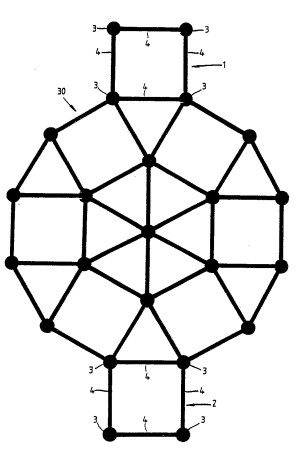
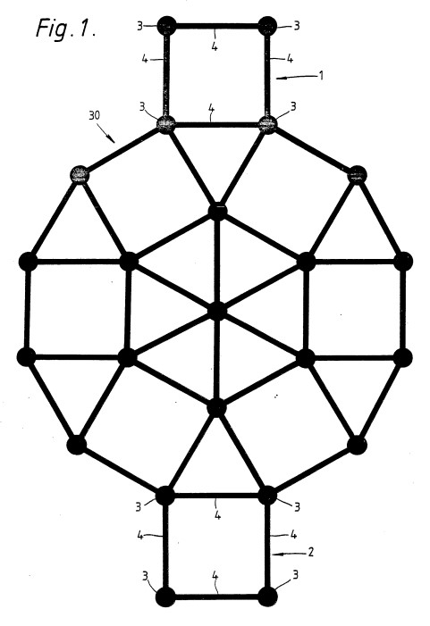
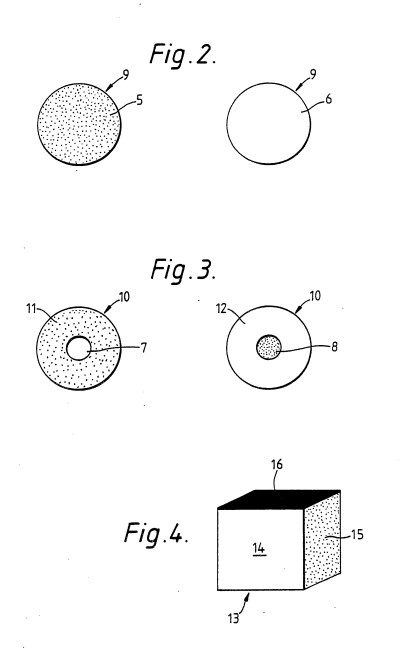
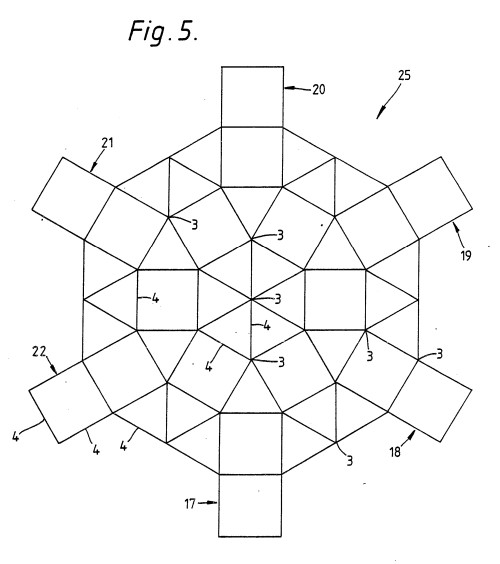

# PATENTE DE TARATI POR GEORGE SPENCER BROWN

## ORGANIZACIÓN MUNDIAL DE LA PROPIEDAD INTELECTUAL

Oficina Internacional
APLICACIÓN INTERNACIONAL PUBLICADA BAJO EL TRATADO DE COOPERACIÓN EN MATERIA DE PATENTES (PCT)

* (51) Clasificación Internacional de Patentes: A63F 3/02 A1
* (12) Número de Publicación Internacional: WO 89/02772
* (43) Fecha de Publicación Internacional: 6 de Abril de 1989 (06.04.89)
* (21) Número de Aplicación Internacional: PCT/GB88/00774
* (22) Fecha de Presentación Internacional: 21 de Septiembre de 1988 (21.09.88)
* (31) Número de Solicitud de Prioridad: 8722462
* (32) Fecha de Prioridad: 24 de Septiembre de 1987 (24.09.87)
* (33) País de Prioridad: GB
* (71)(72) Solicitante e Inventor: SPENCER-BROWN, George [GB/GB]; 18A Greville Place, London NW6 5JH (GB).
* (74) Agente: SKONE JAMES, Robert, Edmund; Gill Jennings & Every, 53/64 Chancery Lane, London WC2A 1HN (GB).
* (81) Estados Designados: AT (patente europea), BE (patente europea), BR, CH (patente europea), DE (patente europea),
  FR (patente europea), GB (patente europea), IT (patente europea), JP, LU (patente europea), NL (patente europea), SE (
  patente europea), US.
* Publicado con informe de búsqueda internacional.

---

* (54) Título: DISPOSITIVO PARA JUGAR UN JUEGO DE MESA
* (57) Resumen  
  Dispositivo para jugar un juego de mesa que comprende un tablero (30) que tiene un número de ubicaciones de base (1,
  2), un número de caminos interconectados (4) que se extienden entre las ubicaciones de base (1, 2) que definen puntos
  de parada (3) en las interconexiones de los caminos. El dispositivo también comprende un número de primeras piezas de
  juego (9) para cada jugador de tal manera que las primeras piezas de juego de cada jugador pueden distinguirse de las
  primeras piezas de juego de otros jugadores y las primeras piezas de juego de cada jugador se posicionan inicialmente
  en una ubicación de base (1, 2) y se avanzan a lo largo de los caminos a través de los puntos de parada (3) hacia otra
  ubicación de base predeterminada (2). Cada vez que las piezas de juego de un jugador (5) se mueven a una relación
  predeterminada con una o más de las piezas de juego de otro jugador (6), dichas piezas de juego se eliminan del
  control de ese jugador o del otro jugador, según corresponda. Típicamente, el dispositivo comprende además un número
  de segundas piezas de juego (10) para cada jugador de tal manera que las segundas piezas de juego de cada jugador
  pueden distinguirse de las segundas piezas de juego de otros jugadores y de las primeras piezas de juego de ese
  jugador. Las segundas piezas de juego (10) reemplazan a cada una de las primeras piezas de juego (9) que alcanzan una
  ubicación de base predeterminada y pueden avanzarse a lo largo de los caminos (4) a través de los puntos de parada (3)
  en cualquier dirección.

---

## DISPOSITIVO PARA JUGAR UN JUEGO DE MESA

Esta invención se refiere a un dispositivo para jugar un juego de mesa.

Según la presente invención se proporciona un dispositivo para jugar un juego de mesa que comprende un tablero que tiene
un número de ubicaciones de base, un número de caminos interconectados que se extienden entre las ubicaciones de base y
de parada definidos por las interconexiones de los caminos; el dispositivo comprende además un número de primeras piezas
de juego para cada jugador, siendo capaces las primeras piezas de juego de cada jugador de distinguirse de las primeras
piezas de juego de otros jugadores, y para posicionamiento inicial en las ubicaciones de base y para avanzar a lo largo
de los caminos a través de los puntos de parada.

La invención permite que el juego de mesa se juegue de manera que cada vez que las piezas de juego de un jugador se
mueven a una relación predeterminada con una o más de las piezas de juego de otro jugador, dichas piezas de juego se
eliminan del control de ese jugador o del otro jugador, según corresponda.

En la realización preferida, el tablero tiene dos ubicaciones de base, aunque en una realización alternativa el tablero
puede tener seis ubicaciones de base. Preferiblemente, los puntos de parada son circulares, aunque podrían ser de forma
de diamante u otra forma adecuada, o incluso por la interconexión de los caminos. Preferiblemente, los caminos son
rectilíneos. Los caminos comprenden típicamente líneas que están marcadas en el tablero. Alternativamente, las líneas
pueden usarse para definir regiones que se utilizan como puntos de parada, moviendo las piezas a través de las líneas a
regiones adyacentes.

Típicamente, cada primera pieza de juego tiene un número de lados indicadores de jugador que llevan respectivos
indicadores diferentes de jugador, de manera que cada pieza puede colocarse en el tablero con cualquiera de sus lados
indicadores de jugador en la parte superior.

En la realización preferida, hay dos lados indicadores de jugador en cada primera pieza de juego, siendo cada lado
indicador de jugador de un color diferente. Preferiblemente, un lado es negro y el otro es blanco, aunque los lados
pueden ser tonos fuertemente contrastantes de otro color.

En una realización alternativa, cada primera pieza de juego es un cubo que tiene seis lados indicadores de jugador que
son de diferentes colores.

Preferiblemente, hay al menos tantos lados indicadores de jugador en cada primera pieza de juego como ubicaciones de
base en el tablero.

Preferiblemente, las piezas de juego para cada jugador avanzan a lo largo de los caminos a través de los puntos de
parada solo en una dirección hacia la otra de las ubicaciones de base, respectivamente. El dispositivo también incluye
preferiblemente un número de segundas piezas de juego para cada jugador, siendo capaces las segundas piezas de cada
jugador de distinguirse de las segundas piezas de juego de otros jugadores y de las primeras piezas de juego, para
reemplazar a cada una de las primeras piezas de juego que alcanzan la otra de las ubicaciones de base y para avanzar a
lo largo de los caminos a través de los puntos de parada en cualquier dirección.

Típicamente, cada segunda pieza de juego tiene dos lados indicadores de jugador, teniendo cada lado indicador de jugador
una sección mayor indicadora de jugador y una sección menor para distinguir la pieza de una primera pieza de juego.
Preferiblemente, las secciones mayor y menor son de diferentes colores, aunque la sección menor podría proporcionarse
mediante un emblema u otra marca distintiva.

Alternativamente, cada una de las primeras piezas de juego puede avanzarse a lo largo de los caminos a través de los
puntos de parada en cualquier dirección después de haber alcanzado otra ubicación de base predeterminada y en la que las
primeras piezas de juego están adaptadas para indicar si se pretende avanzarlas solo en una dirección hacia una
ubicación de base predeterminada o en cualquier dirección.

Para que la invención pueda comprenderse más fácilmente, se describe a continuación una realización de acuerdo con la
misma con referencia a los dibujos adjuntos, en los cuales:

Figura 1 muestra una representación diagramática de un tablero de juego,

Figura 2 muestra esquemáticamente ambos lados de una pieza de juego,
Figura 3 muestra esquemáticamente ambos lados de otra pieza de juego, y

Figuras 4 y 5 muestran respectivamente otra realización de las piezas de juego y el tablero, de acuerdo con la
invención.

Refiriéndose a la Figura 1, el tablero de juego comprende dos bases `1`, `2` ubicadas en extremos opuestos del tablero y
cada una consistente en cuatro puntos de parada, como se muestra en `3`, unidos por cuatro caminos en forma de líneas,
como se muestra en `4`, en la formación de un cuadrado. Una extensión imaginaria en ambos lados de la línea entre los
puntos de parada más externos en cada extremo se denomina "línea de base". Entre las dos bases hay una red de 34 caminos
interconectados también en forma de líneas que definen la ubicación de 15 puntos de parada adicionales en las
interconexiones de las líneas. Las líneas son todas de igual longitud, de manera que los puntos de parada están
igualmente espaciados de todos los puntos de parada adyacentes, utilizándose el término "adyacentes" para definir puntos
de parada unidos por una sola línea y "no adyacentes" significando puntos de parada unidos por dos o más líneas
intermedias y al menos otro punto de parada.

Las líneas en la región central de la red forman un hexágono regular con esquinas opuestas unidas por líneas rectas para
formar triángulos equiláteros. Se forma un cuadrado exterior en cada lado del hexágono y las otras esquinas adyacentes
de los cuadrados se unen mediante líneas adicionales, incluyendo una desde cada una de las bases, para formar seis
triángulos equiláteros más que completan un dodecágono regular.

Para tableros pequeños o de bolsillo, la longitud de cada línea es preferiblemente 2,5 cm y la longitud total de la
representación en el tablero es preferiblemente 14,33 cm. En tableros de tamaño mediano, la longitud de la
representación es preferiblemente alrededor de 32 cm y en tableros grandes preferiblemente alrededor de 40 cm.

Un conjunto de piezas de juego consiste en una pluralidad de tokens discoidales reversibles, conocidos como "piezas
comunes" o "cobs", construidos uniformemente para ser indistinguibles entre sí. Cada cara `5`,`6` de uno de estos tokens
`9`, mostrada en la Figura 2, donde puede verse que una cara `5` está coloreada de un color oscuro y la otra cara `6`
está coloreada de un color claro. Las piezas con el lado de color claro hacia arriba se conocen como "blancas" y las
piezas con el lado de color oscuro hacia arriba se conocen como "negras". Los colores claro y oscuro pueden ser en
realidad blanco y negro, respectivamente, o cualesquier dos tonos fuertemente contrastantes del mismo color.

Un segundo conjunto de piezas de juego consiste en una pluralidad de tokens `10`, cada cara `11`, `12` de uno de los
cuales se muestra en la Figura 3. Puede verse que estas piezas están construidas y coloreadas de manera similar a las
piezas "cob" `9`, excepto por una marca contrastante, `7`,`8`, como un punto centralmente posicionado o un emblema en
cada cara `11`, `12`. Las piezas de juego del segundo conjunto se conocen como "piezas reales" o "roks".

Los diámetros de todas las piezas de juego deben ser los mismos y relacionados con el tamaño del tablero.
Preferiblemente, una línea entre puntos de parada adyacentes en el tablero tiene una longitud entre dos y un octavo y
dos y un cuarto del diámetro de las piezas de juego, de manera que una pieza de juego debe poder pasar estrechamente,
pero cómodamente, entre dos otras piezas colocadas centralmente en puntos adyacentes sin tocar ninguna de ellas. Las
piezas de juego de ambos conjuntos son preferiblemente de un grosor no superior a la mitad de su diámetro para uso en
tableros pequeños y no inferior a un quinto de su diámetro para uso en tableros de tamaño mediano o grande. El ancho de
las líneas debe ser no mayor que un octavo del diámetro de las piezas, y los puntos de parada, si se resaltan, deben
tener un diámetro menor que la mitad del diámetro de las piezas de juego. La longitud total de la representación en el
tablero se determina como S(4 + tan 60°), donde S es la distancia entre puntos adyacentes. El tablero puede ser pintado,
impreso o incrustado en material sólido, y la representación y el fondo son de tonos contrastantes, que son
preferiblemente los mismos o similares a los utilizados para las piezas de juego. También pueden usarse marcas o colores
adicionales para distinguir cada extremo del tablero.

El tablero y las piezas de juego están diseñados y construidos para dos jugadores, cada uno asociado con uno de los dos
colores de las piezas de juego y una de las bases. El tablero y las piezas de juego, de acuerdo con la invención, pueden
usarse para jugar varios juegos diferentes, uno de cuyos objetivos típicamente es capturar o inmovilizar las piezas de
juego del oponente. Las reglas para cada uno de los juegos son las siguientes.

En el primer juego, se usan ocho piezas reversibles "cob" `9` y ocho piezas reversibles "rok" `10`.

Al comienzo del primer juego, se coloca una pieza "cob" blanca en cada uno de los cuatro puntos de parada de una base y
una pieza "cob" negra en cada uno de los cuatro puntos de la otra base. Los jugadores mueven sus piezas
alternativamente, con las piezas "cob" blancas jugando primero, avanzando una pieza "cob" desde un punto de parada a lo
largo de una línea en la dirección de la base del oponente a un punto de parada adyacente. Una pieza "cob" solo puede
moverse a un punto más cercano a la "línea de base" del oponente excepto cuando dicha pieza comienza un movimiento en
uno de sus propios puntos de parada de base, en cuyo caso puede moverse en cualquier dirección para efectuar una
captura, como se describe a continuación. Ninguna pieza puede moverse a un punto de parada ocupado por otra pieza.

Cuando una pieza se mueve desde un punto de parada no adyacente a un punto de parada adyacente a una pieza del oponente,
se dice que ha capturado a dicha pieza. La pieza capturada permanece en el mismo punto de parada, pero se da la vuelta,
de manera que su cara opuesta esté hacia arriba, para mostrar el color opuesto, y posteriormente pertenece al jugador
que ha capturado.

Más de una pieza puede ser capturada por el mismo movimiento, pero ninguna pieza puede ser capturada por una pieza que
estaba adyacente a ella antes del movimiento.

Una pieza "cob" se promociona a una pieza "rok" cuando se avanza a un punto de parada de la base del oponente, y la
pieza "cob" se retira del tablero y se sustituye por una pieza "rok" con el mismo color hacia arriba. Una pieza "cob"
capturada en uno de sus propios puntos de parada de base no se promociona inmediatamente, sino que se convierte en una
pieza "cob" del color opuesto al darle vuelta en el punto de base del oponente. Luego se promociona si se avanza más
tarde.

A diferencia de una pieza "cob", una pieza "rok" puede moverse en cualquier dirección a lo largo de las líneas.

Una pieza "cob" en uno de los dos puntos de parada de base más externos del oponente no puede avanzarse y se dice que
está "muerta". Una pieza "cob", cuyo único camino legal está bloqueado por una pieza "muerta", también está "muerta".
Una pieza no es necesariamente "muerta" si no puede moverse. Por ejemplo, ninguna pieza "rok" puede estar "muerta", y
una pieza "cob", cuyo camino está bloqueado por una pieza "cob" del color opuesto, o por una pieza "cob" "viva" del
mismo color, o por una pieza "rok" de cualquier color, no está "muerta". Un jugador que no puede mover ninguna de sus
piezas, pero que posee una o más piezas "muertas", puede promocionar una de ellas a una pieza "rok", si esto permite que
se mueva. Un jugador con una pieza "cob", que es la única pieza restante de su color, debe promocionarla en cualquier
caso, dondequiera que esté posicionada.

El juego termina con una victoria para un jugador o un empate. Un jugador gana si, en primer lugar, el oponente no puede
mover legalmente ninguna de sus piezas, o en segundo lugar el oponente renuncia o abandona el juego, o en tercer lugar,
si se impone un límite de tiempo para realizar un número determinado de movimientos, el oponente no completa el número
requerido de movimientos en el límite de tiempo. El juego es un empate si, en primer lugar, los jugadores acuerdan un
empate. En segundo lugar, el juego es un empate si los movimientos del juego han sido registrados y un jugador puede
demostrar que al menos cincuenta movimientos consecutivos, incluyendo el movimiento jugado por última vez, han sido
jugados por cada jugador sin mover ni promocionar una pieza "cob". Este empate no puede reclamarse, sin importar el
recuento, si un jugador ya ha ganado el juego o puede ganar, porque el oponente no puede mover legalmente ninguna pieza,
en la próxima oportunidad de jugar. En tercer lugar, el juego es un empate si un jugador anuncia correctamente que, al
finalizar su próximo movimiento previsto, la posición resultante habrá ocurrido al menos tres veces. Las piezas del
mismo rango y color deben ocupar puntos de parada idénticos y debe ser el turno del mismo jugador en cada ocasión. Si la
reclamación es incorrecta, el movimiento anunciado, si es legal, debe jugarse y el juego continúa sin perjuicio del
derecho del reclamante a reclamar el empate en una etapa posterior. Los movimientos pueden registrarse utilizando
cualquier notación adecuada y etiquetando o numerando los puntos de parada, por ejemplo, de manera similar a las
referencias de mapa.

En el segundo juego, solo se usa un conjunto de piezas de juego, preferiblemente consistente en 22 piezas reversibles
que tienen colores claro y oscuro en caras respectivas.

Como en el primer juego, cada jugador elige un color claro u oscuro y coloca una pieza en cada uno de sus cuatro puntos
de parada de base. Nuevamente, el jugador con las piezas de color más claro comienza avanzando una pieza a lo largo de
una línea a un punto de parada adyacente. También, de acuerdo con las piezas "cob" del primer juego, las piezas deben
moverse hacia la "línea de base" del oponente y ninguna pieza puede moverse a un punto de parada ya ocupado.

Si una pieza finaliza su movimiento adyacente a una o más piezas del oponente, el jugador debe pagar ese número de
piezas, conocidas como piezas "penalización", al oponente, colocándolas en puntos de parada en el tablero, excepto que
no pueden colocarse adyacentes a ninguna de las piezas propias del jugador ni más cerca de la línea de base del jugador
que la pieza más avanzada del oponente. Si el jugador no puede colocar todas las piezas "penalización", debe colocar
tantas como sea posible y luego pagar la diferencia eliminando sus propias piezas del tablero. Si no es posible para un
jugador avanzar ninguna de sus piezas, debe eliminar una de ellas del tablero. Un jugador gana cuando el oponente no
tiene piezas restantes en el tablero.

Si una posición se repite, con ninguno de los jugadores dispuesto a romper la secuencia de movimientos que condujo a
ella, algún medio que involucre azar, como una moneda o dados, puede usarse para determinar qué jugador debe romper la
secuencia. El ganador de partidas, donde se juega más de un juego, puede decidirse contando ya sea el número de juegos
ganados, o el número de piezas restantes en el tablero cuando cada juego ha terminado, que luego se usan como puntos
hacia una puntuación final para el partido.

Aunque se ha descrito una realización particular, se entenderá que pueden hacerse modificaciones sin salir del alcance
de la invención. Por ejemplo, algunas de las líneas del tablero pueden ser curvas en lugar de rectas, para formar
círculos en lugar del hexágono y dodecágono, o alternativamente cualquier otra formación de líneas y puntos
interconectados puede utilizarse. Además, los "puntos de parada", que se resaltan en la representación mostrada en la
figura, pueden ser de una forma diferente a circular, como un cuadrado o diamante. Alternativamente, los puntos de
parada pueden formarse simplemente por la reunión de las líneas, sin énfasis específico en ellas.

En lugar de usar piezas de juego reversibles, pueden usarse piezas de juego de color uniforme, proporcionando piezas de
diferentes colores para cada jugador, en cuyo caso se requerirá el doble del número de piezas para dos jugadores. De
esta manera, más de dos jugadores podrían jugar al mismo tiempo y también se pueden proporcionar más de dos bases
alrededor de la periferia del tablero. Alternativamente, para el primer juego, cada pieza de juego podría ser de color
uniforme con un emblema u otra marca contrastante en una cara, de manera que una sola pieza de juego puede usarse tanto
como pieza "cob" como pieza "rok" para cada jugador.

Las piezas de juego que tienen más de dos caras pueden usarse para más de dos jugadores, con cada cara coloreada o
marcada de manera diferente para cada jugador. De esta manera, por ejemplo, una pieza de juego cúbica, `13` como se
muestra en la Figura 4, con cada una de sus caras (solo tres mostradas) de colores diferentes puede usarse para hasta
seis jugadores, teniendo cada jugador su color hacia arriba cuando la pieza de juego está en el tablero. Una
modificación particular del tablero para hasta seis jugadores se muestra mediante la representación diagramática en la
Figura 5. Puede verse que el tablero `25` tiene seis ubicaciones de base igualmente espaciadas alrededor del tablero,
con una red más grande de líneas `4` entre ellas.

En un juego que utiliza el tablero `25` y las piezas de juego cúbicas `13` mostradas en las Figuras 4 y 5, los jugadores
comienzan colocando cada uno cuatro piezas de juego con su respectiva cara coloreada hacia arriba, en su respectiva
base. Si juegan menos de seis jugadores, deben seleccionarse bases espaciadas tan uniformemente como sea posible
alrededor del tablero. Los jugadores avanzan sus piezas de juego, por turnos, a lo largo de las líneas `4` a los puntos
de parada `3`, como en los juegos descritos anteriormente, en cualquier dirección, excepto que un movimiento inicial
desde un punto de parada de base debe ser a lo largo de una de las líneas que forman un cuadrado inmediatamente
adyacente a esa base. Las piezas de juego son capturadas, como en los juegos descritos anteriormente, cuando una pieza
de juego de un jugador se mueve adyacente a una o más piezas de juego de otro jugador. Las piezas de juego cúbicas de
otros jugadores se dan entonces la vuelta de manera que el color del primer jugador esté hacia arriba. Un jugador que no
puede mover ninguna de sus piezas de juego o cuyas piezas de juego han sido capturadas todas se retira del juego. Si
este jugador tiene alguna de sus piezas restantes en el tablero, se eliminan. Cuando solo quedan dos jugadores en el
juego, el juego termina y el ganador es el que tiene más piezas restantes en el tablero, o si el número de piezas es
igual, ambos jugadores comparten la posición ganadora.

---

## REIVINDICACIONES

1. Dispositivo para jugar un juego de mesa que comprende un tablero (30;25) que tiene un número de ubicaciones de base (
   1,2; 17-22), un número de caminos interconectados (4) que se extienden entre las ubicaciones de base (1,2; 17-22) y
   puntos de parada (3) definidos por las interconexiones de los caminos (4); el dispositivo comprende además un número
   de primeras piezas de juego (9;13) para cada jugador, siendo capaces las primeras piezas de juego de cada jugador de
   distinguirse de las primeras piezas de juego de otros jugadores, y para posicionamiento inicial en las ubicaciones de
   base (1,2) y para avanzar a lo largo de los caminos (4) a través de los puntos de parada (3).

2. Dispositivo según la reivindicación 1, en el que el tablero (25) tiene seis ubicaciones de base (17,18,19,20,21,22).

3. Dispositivo según la reivindicación 1, en el que el tablero (30) tiene dos ubicaciones de base (1,2).

4. Dispositivo según la reivindicación 1, en el que cada primera pieza de juego (9;13) tiene un número de lados
   indicadores de jugador (5,6) que llevan respectivos indicadores diferentes de jugador, de manera que cada pieza puede
   colocarse en el tablero con cualquiera de sus lados indicadores de jugador en la parte superior.

5. Dispositivo según la reivindicación 4, en el que hay dos lados indicadores de jugador (5,6).

6. Dispositivo según la reivindicación 4, en el que hay seis lados indicadores de jugador.

7. Dispositivo según la reivindicación 4, en el que los respectivos indicadores diferentes de jugador se proporcionan
   mediante diferentes colores.

8. Dispositivo según la reivindicación 5, en el que los indicadores de jugador son dos tonos fuertemente contrastantes
   del mismo color.

9. Dispositivo según la reivindicación 8, en el que un tono es blanco y el otro tono es negro.

10. Dispositivo según la reivindicación 4, en el que cada primera pieza de juego (9;13) tiene al menos el mismo número
    de lados indicadores de jugador que el número de ubicaciones de base (1,2; 17-22) en el tablero (25;30).

11. Dispositivo según la reivindicación 1, en el que los puntos de parada (3) son circulares.

12. Dispositivo según la reivindicación 1, en el que los caminos (4) son rectilíneos.

13. Dispositivo según la reivindicación 1, que comprende además un número de segundas piezas de juego (10) para cada
    jugador, siendo capaces las segundas piezas de juego de cada jugador de distinguirse de las segundas piezas de juego
    de otros jugadores y de las primeras piezas de juego (9) de ese jugador.

14. Dispositivo según la reivindicación 13, en el que cada segunda pieza de juego (10) tiene un número de lados
    indicadores de jugador (11,12), teniendo cada lado indicador de jugador una sección mayor indicadora de jugador (
    11,12) y una sección menor (7,8) para distinguir cada segunda pieza de juego (10) de una primera pieza de juego (9).

15. Dispositivo según la reivindicación 14, en el que las secciones mayor indicadora de jugador (11,12) y menor (7,8)
    son de diferentes colores.

16. Dispositivo según la reivindicación 14, en el que cada segunda pieza de juego tiene seis lados indicadores de
    jugador.

17. Dispositivo según la reivindicación 14, en el que cada segunda pieza de juego tiene dos lados indicadores de
    jugador.

18. Dispositivo según la reivindicación 17, en el que las secciones indicadoras de jugador son dos tonos fuertemente
    contrastantes del mismo color.

19. Dispositivo según la reivindicación 18, en el que el tono de una sección indicadora de jugador es blanco y el tono
    de la otra sección indicadora de jugador es negro.

20. Dispositivo según la reivindicación 1, en el que las primeras piezas de juego pueden avanzarse a lo largo de los
    caminos (4) a través de los puntos de parada (3) en cualquier dirección después de haber alcanzado otra ubicación de
    base predeterminada y en el que las primeras piezas de juego están adaptadas para indicar si se pretende avanzarlas
    solo en una dirección hacia una ubicación de base predeterminada o en cualquier dirección.